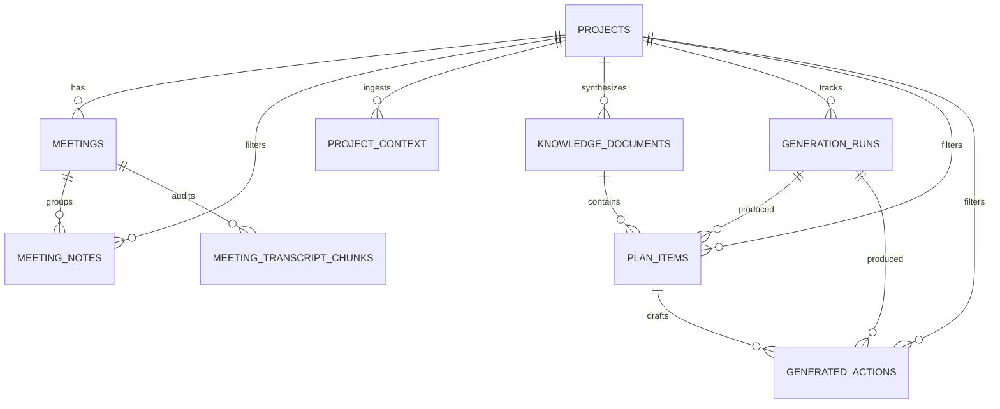

# Project Brain Supabase Database

This is the v2 database contract for the hackathon demo. The hosted project is:

- Project ref: `walgjemfqjxhrixqtaey`
- URL: `https://walgjemfqjxhrixqtaey.supabase.co`
- Source of truth SQL: `supabase/migration_to_v2.sql`

## ERD



`meetingId` in the frontend is `meetings.id`. It is an internal Supabase UUID, not a Google Meet ID. For the demo, Jin should select the latest `meetings` row with `status = 'live'` for the project, or use a pre-seeded row titled `Demo Standup`.

## Tables

| Table | Purpose | Writer | Frontend use |
|---|---|---|---|
| `projects` | Project records | Seed/admin | Project list and header |
| `meetings` | Internal meeting sessions | Seed/Jin/Yudong setup | Provides `meetingId` for `VoiceAgent` |
| `meeting_notes` | Structured voice-agent notes with optional `embedding vector(1536)` | Yudong with anon key | Inputs tab and vector search |
| `meeting_transcript_chunks` | Raw transcript audit chunks | Yudong with anon key | Optional/debug trail |
| `project_context` | Hyperspell context from Slack, Drive, Notion, Gmail with optional `embedding vector(1536)` | Yash service role | Inputs tab and vector search |
| `knowledge_documents` | Weekly synthesis: summary, themes, decisions, blockers, open questions | Yash service role | Knowledge Doc tab |
| `generation_runs` | `/plan/generate` status and idempotency | Yash service role | Header status pill |
| `plan_items` | Categorized work items: `bug_fix`, `new_feature`, `maintenance` | Yash service role | Knowledge Doc tab |
| `generated_actions` | Linear, GitHub PR, and Devin action drafts | Yash service role | Actions tab |

## Important Design Choices

- `generated_actions.project_id` is intentionally denormalized so Supabase Realtime can filter directly with `project_id=eq.<projectId>`.
- `plan_items.project_id` is also denormalized for simple frontend queries.
- `meeting_notes.project_id` supports project-level Realtime subscriptions, while `meeting_notes.meeting_id` groups notes under a specific internal meeting.
- `knowledge_documents` is unique by `(project_id, week_start)` so the current weekly synthesis has one canonical row.
- `meeting_notes.embedding` and `project_context.embedding` are both `vector(1536)` for OpenAI `text-embedding-3-small`.

## Realtime

Subscribe with `project_id=eq.<projectId>` where the table has `project_id`:

| Table | UI target |
|---|---|
| `meeting_notes` | Inputs -> Meetings |
| `project_context` | Inputs -> Project Context |
| `knowledge_documents` | Knowledge Doc |
| `plan_items` | Knowledge Doc plan items |
| `generated_actions` | Actions |
| `generation_runs` | Header status |

`meeting_transcript_chunks` is also in the Realtime publication for audit/debug flows, but the main UI does not need to subscribe to it.

## RLS And Privileges

RLS is enabled on all v2 app tables.

Demo policy:

- `anon` can `SELECT` all demo tables.
- `anon` can `INSERT` only into `meeting_notes` and `meeting_transcript_chunks`.
- Browser code should not update rows directly.
- FastAPI uses `SUPABASE_SERVICE_ROLE_KEY` for backend-owned writes and updates.

Update flows should go through FastAPI:

- `/ingest/hyperspell` writes `project_context`.
- `/plan/generate` writes `generation_runs`, `knowledge_documents`, `plan_items`, and `generated_actions`.
- `/actions/{id}/execute` updates `generated_actions`.

## Environment

Frontend:

```bash
NEXT_PUBLIC_SUPABASE_URL=https://walgjemfqjxhrixqtaey.supabase.co
NEXT_PUBLIC_SUPABASE_PUBLISHABLE_KEY=sb_publishable_bXSjd0SPih0685J6YaG1hA_SEoSi_kq
```

Backend:

```bash
SUPABASE_URL=https://walgjemfqjxhrixqtaey.supabase.co
SUPABASE_SERVICE_ROLE_KEY=<from Supabase dashboard>
```

Never commit `.env` or expose `SUPABASE_SERVICE_ROLE_KEY` to frontend code.
